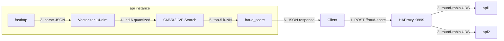

<h1 align="center">Rinha de Backend 2026 — Go + C/AVX2</h1>

<p align="center"><strong>Fraud detection API using IVF vector search with hand-tuned AVX2 kernels</strong></p>

<p align="center">
  
  
  
  
  
  
</p>

---

**Submission for [Rinha de Backend 2026](https://github.com/zanfranceschi/rinha-de-backend-2026)** — fraud detection via vector search. Processes card transactions through a 14-dimensional feature vectorizer, searches 3 million reference vectors using IVF/K-means with AVX2-accelerated Euclidean distance, and returns fraud probability via k-NN majority vote.

## Quick Start

```bash
docker compose up --build
```

The API listens on port `9999`. Use the smoke test to verify:

```bash
# Requires k6 (https://k6.io)
cd test && k6 run smoke.js
```

### Pre-built images (from GitHub release)

```bash
IMAGE=ghcr.io/macedot/rinha-2026-go:latest docker compose up
```

Replace `build: .` with `image: ghcr.io/macedot/rinha-2026-go:latest` in `docker-compose.yml`.

## API

### `GET /ready`

Returns `200 OK` when the API has loaded the index and is ready to serve.

### `POST /fraud-score`

**Request:**
```json
{
  "id": "tx-1329056812",
  "transaction":      { "amount": 41.12, "installments": 2, "requested_at": "2026-03-11T18:45:53Z" },
  "customer":         { "avg_amount": 82.24, "tx_count_24h": 3, "known_merchants": ["MERC-003", "MERC-016"] },
  "merchant":         { "id": "MERC-016", "mcc": "5411", "avg_amount": 60.25 },
  "terminal":         { "is_online": false, "card_present": true, "km_from_home": 29.23 },
  "last_transaction": null
}
```

**Response:**
```json
{ "approved": true, "fraud_score": 0.0000 }
```

Full API contract: [docs/en/API.md](https://github.com/zanfranceschi/rinha-de-backend-2026/blob/main/docs/en/API.md)

## Architecture

```
                           ┌──────────┐
                           │  Client  │
                           └─────┬────┘
                                 │ HTTP :9999
                          ┌──────▼────────┐
                          │  HAProxy 3.3  │
                          │  cpus: 0.15   │
                          │  mem:  50 MB  │
                          └───┬───────┬───┘
                              │       │
                     UDS /sockets/    UDS /sockets/
                      api1.sock       api2.sock
                   ┌──────▼──────┐ ┌──────▼──────┐
                   │    api1     │ │    api2     │
                   │ cpus: 0.425 │ │ cpus: 0.425 │
                   │ mem: 150 MB │ │ mem: 150 MB │
                   │             │ │             │
                   │┌───────────┐│ │┌───────────┐│
                   ││ fasthttp  ││ ││ fasthttp  ││
                   ││ UDS server││ ││ UDS server││
                   │└─────┬─────┘│ │└─────┬─────┘│
                   │      │      │ │      │      │
                   │┌─────▼─────┐│ │┌─────▼─────┐│
                   ││ Vectorizer││ ││ Vectorizer││
                   ││ 14-dim    ││ ││ 14-dim    ││
                   │└─────┬─────┘│ │└─────┬─────┘│
                   │      │      │ │      │      │
                   │┌─────▼─────┐│ │┌─────▼─────┐│
                   ││ C/AVX2    ││ ││ C/AVX2    ││
                   ││ IVF Search││ ││ IVF Search││
                   ││ 1024 cls. ││ ││ 1024 cls. ││
                   │└───────────┘│ │└───────────┘│
                   └─────────────┘ └─────────────┘

    ┌──────────────────────────────────────────────────────┐
    │  rinha-sockets (tmpfs, 10mb)  ·  bridge network      │
    │  CPU total: 1.0   |   Memory total: 350 MB           │
    └──────────────────────────────────────────────────────┘
```

### Request flow



### How it works

1. **Client** sends `POST /fraud-score` with transaction JSON to port `9999`
2. **HAProxy** round-robin forwards the raw HTTP request over a **Unix Domain Socket** (`/sockets/api1.sock` or `api2.sock`) — zero TCP overhead, no payload inspection
3. **fasthttp** parses the JSON body (zero-allocation custom parser) and extracts all fields
4. **Vectorizer** transforms the payload into a 14-dimension float vector using the official normalization formulas, then quantizes to `int16` for the C bridge
5. **C/AVX2 IVF Search** selects the 4 nearest clusters (out of 1024), scans their points with AVX2-accelerated Euclidean distance (early termination + 2× unroll), and returns the k=5 nearest neighbors
6. **fraud_score** = frauds among top 5 / 5; `approved = fraud_score < 0.6`

### Components

| Component | Language | Role |
|-----------|----------|------|
| **HAProxy 3.3** | C | Layer 7 load balancer, round-robin over UDS (`balance roundrobin`) |
| **fasthttp server** | Go | HTTP handling, UDS listener, zero-allocation JSON parsing |
| **Vectorizer** | Go | 14-dim feature vectorizer following official normalization rules; `int16` quantization |
| **IVF Search bridge** | C/AVX2 | IVF/K-means search: 1024 clusters, centroid distance ranking, bounding-box pruning, AVX2 Euclidean distance with early termination and 2× loop unrolling |
| **build_index** | Go | Pre-processes `references.json.gz` (3M vectors) into IVF6 binary index: K-means clustering, `int16` quantization, column-major layout, per-cluster bounding boxes |

### Transport

HAProxy communicates with the API instances via **Unix Domain Sockets** on a `tmpfs` volume (`rinha-sockets`). This eliminates TCP overhead entirely — no kernel network stack, no socket buffers, no accept queues. A single 10 MB tmpfs volume holds both API socket files.

### Tech Stack

- **Go 1.24** — fasthttp HTTP server, UDS transport, custom zero-alloc JSON parser
- **C (CGO)** — AVX2 intrinsics for Euclidean distance, IVF/K-means search engine
- **HAProxy 3.3** — stateless round-robin load balancer
- **Docker Compose** — 3 services, bridge network, resource limits via `deploy.resources.limits`

## Optimization Highlights

The IVF search kernel underwent extensive micro-optimization targeting p99 latency on a [Mac Mini Late 2014](https://support.apple.com/en-us/111931) (2.6 GHz Haswell, 8 GB RAM) with Docker resource limits of 1.0 CPU and 350 MB total memory.

| Optimization | Impact | Technique |
|-------------|--------|-----------|
| **1024 IVF clusters** | -0.25ms p99 | Finer partitioning cuts scanned points from ~58K to ~12K per query |
| **AVX2 early termination** | -0.06ms | Skip 11 dims for batches where all 8 lanes exceed worst distance after first 3 dims |
| **2× loop unroll** | -0.05ms | Process 16 elements per iteration with interleaved dimension accumulation to hide memory latency |
| **Cluster reordering** | -0.03ms | Scan smallest clusters first to tighten `worst_d` sooner, enabling more early termination |
| **GOGC=100, GOMEMLIMIT=100MiB** | -0.02ms | Tuned GC to avoid stop-the-world pauses under load |
| **UDS transport** | -0.08ms | HAProxy ↔ API via Unix domain sockets (zero TCP overhead) |

**Overall: 1.56ms → 0.99ms p99 (-36%), score 5806 → 6000 (+194 pts)**

## Configuration

| Variable | Default | Description |
|----------|---------|-------------|
| `IVF_NPROBE` | `4` | Number of IVF clusters to probe per query |
| `CANDIDATES` | `0` | Max candidates to scan (0 = unlimited + bbox pass) |
| `GOGC` | `100` | Go GC target percentage |
| `GOMEMLIMIT` | `100MiB` | Go soft memory limit |
| `AMOUNT_DIVISOR` | `10000` | Normalization constant (max_amount) |
| `INSTALLMENTS_DIVISOR` | `12` | Normalization constant (max_installments) |
| `TX24H_DIVISOR` | `20` | Normalization constant (max_tx_count_24h) |
| `KM_DIVISOR` | `1000` | Normalization constant (max_km) |
| `MERCHANT_AMOUNT_DIVISOR` | `10000` | Normalization constant (max_merchant_avg_amount) |

All normalization constants match the official `normalization.json`.

## Repository Structure

```
# main branch
├── cmd/
│   ├── server/main.go          # fasthttp API server
│   └── build_index/main.go     # IVF index builder (K-means + quantization)
├── internal/
│   ├── config/config.go        # Environment-based configuration
│   ├── vectorizer/vectorizer.go # 14-dim feature vectorizer
│   ├── ivfsearch/
│   │   ├── bridge.c            # C/AVX2 IVF search kernel
│   │   ├── bridge.h            # CGO bridge header
│   │   ├── bridge.go           # CGO Go bindings
│   │   └── ivfsearch.go        # Go search interface
│   ├── jsonparse/jsonparse.go  # Zero-allocation JSON parser
│   ├── mccrisk/mccrisk.go      # MCC risk lookup table
│   └── httpresp/httpresp.go    # Pre-computed HTTP responses
├── resources/
│   ├── index.bin               # Pre-built IVF6 index (3M vectors, 1024 clusters)
│   ├── mcc_risk.json           # Merchant category risk table
│   ├── references.json.gz      # 3M labeled reference vectors (input to build_index)
│   └── example-payloads.json   # Example transaction payloads
├── test/
│   ├── test.js                 # k6 load test (ramping arrival rate)
│   ├── smoke.js                # Quick smoke test (5 iterations)
│   └── test-data.json          # 54,100 test transactions
├── Dockerfile                  # Multi-stage: Go build → slim Debian runtime
├── docker-compose.yml          # 3-service deployment with resource limits
├── haproxy.cfg                 # HAProxy round-robin UDS configuration
├── .github/workflows/release.yml # CI: build & push Docker image to GHCR
├── LICENSE                     # MIT
├── info.json                   # Rinha participant info
└── README.md
```

> The `submission` branch contains only `docker-compose.yml`, `haproxy.cfg`, and `info.json` — no source code.

## CI/CD

GitHub Actions builds and pushes a `linux/amd64` Docker image to `ghcr.io/macedot/rinha-2026-go` on every published release (prereleases excluded). Images are tagged with both the release version and `latest`.

## Test Environment

The official test runs on a Mac Mini Late 2014 (2.6 GHz Haswell, 8 GB RAM, Ubuntu 24.04) with Docker resource limits of **1.0 CPU** and **350 MB memory** across all services. All optimizations were tuned specifically for this hardware.

## License

This project is licensed under the [MIT License](LICENSE).
